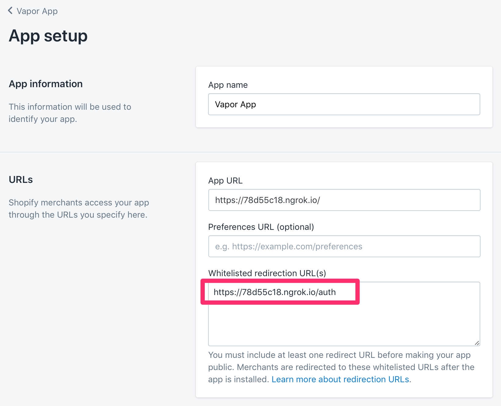

# Federated Login with Shopify

Create a Shopify Partner account by [registering here](https://www.shopify.ca/partners).

Create a new app by following [this guide](https://help.shopify.com/en/api/getting-started/authentication/public-authentication)

Now that we have the necessary information for Shopify, we will setup Imperial with our application.

Add the following line of code to your `dependencies` array in your package manifest file:

```swift
.package(url: "https://github.com/vapor-community/Imperial.git", from: "0.8.0")
```

**Note:** There might be a later version of the package available, in which case you will want to use that version.

You will also need to add the package as a dependency for the targets you will be using it in:

```swift
.target(name: "App", dependencies: ["Vapor", "Imperial"],
               exclude: [
                   "Config",
                   "Database",
                   "Public",
                   "Resources"
               ]),
```

Then run `vapor update` or `swift package update`. Make sure you regenerate your Xcode project afterwards if you are using Xcode.

Now that Imperial is installed, we need to add `SessionMiddleware` to our middleware configuration:

```swift
public func configure(
    _ config: inout Config,
    _ env: inout Environment,
    _ services: inout Services
) throws {
    //...

    // Register middleware
    var middlewares = MiddlewareConfig() // Create _empty_ middleware config
	// Other Middleware...
    middlewares.use(SessionsMiddleware.self)
    services.register(middlewares)
    
	//...
}

```

Now, when you run your app and you are using `FluentSQLite`, you will probably get the following error:

```
⚠️ [ServiceError.ambiguity: Please choose which KeyedCache you prefer, multiple are available: MemoryKeyedCache, FluentCache<SQLiteDatabase>.] [Suggested fixes: `config.prefer(MemoryKeyedCache.self, for: KeyedCache.self)`. `config.prefer(FluentCache<SQLiteDatabase>.self, for: KeyedCache.self)`.]
```

Just pick one of the listed suggestions and place it at the top of your `configure` function. If you want your data to persist across server reboots, use `config.prefer(FluentCache<SQLiteDatabase>.self, for: KeyedCache.self)`

Imperial uses environment variables to access the client ID and secret to authenticate with Shopify. To allow Imperial to access these tokens, you will create these variables, called `SHOPIFY_CLIENT_ID` and `SHOPIFY_CLIENT_SECRET`, with the *API key* and *API secret key* found in the App credentials in the Partner Dashboard. Imperial can then access these vars and use there values to authenticate with Shopify.


Now, all we need to do is register the Shopify service in your main router method, like this:

```swift
import Imperial

try router.oAuth(from: Shopify.self, 
                 authenticate: "login-shopify", 
                 callback: "http://localhost:8080/auth", 
                 scope: ["read_products", "read_orders"], 
                 redirect: "/")
```

The `callback` argument is the path you will go to when you want to authenticate the shop. The `callback` argument has to be the same path that you entered as a *Whitelisted redirection URL* on the app in the Partner Dashboard:



The completion handler is fired when the callback route is called by the OAuth provider. The access token is passed in and a response is returned.

If you ever want to get the `access_token` in a route, you can use a helper method for the `Request` type that comes with Imperial:

```swift
let token = try request.accessToken()
```

You can make authenticated requests to the [REST API](https://help.shopify.com/en/api/reference) requests with a header X-Shopify-Access-Token: {access_token} where {access_token} is replaced with the access token.